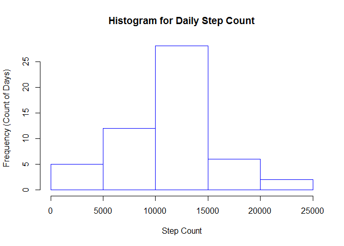
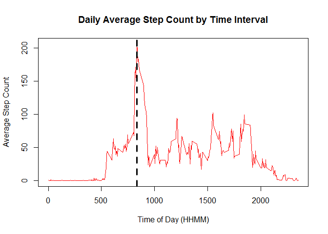
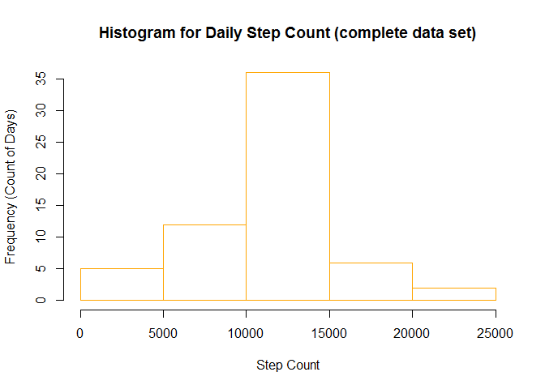
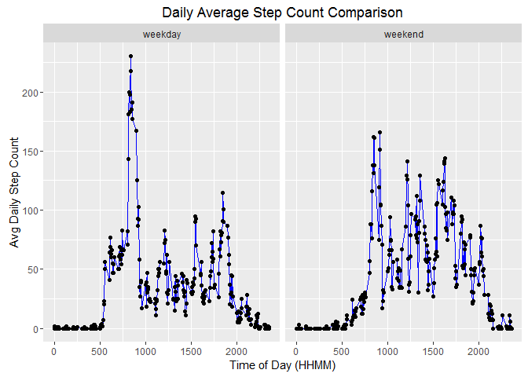

# Project Assignment: Daily Step Activity Analysis


```r
## SETUP ENVIRONMENT
library(dplyr)
library(sqldf)
library(lubridate)
require(data.table)
library(graphics)
library(stringr)
library(chron)
library(knitr)
library(ggplot2)
## example pre-requisite to code execution
## setwd("C:/Donald/Personal/Coursera/Data Science Specialization/Course5_Reproducible Research/Week2/Assignment")
```


```r
## READ_RAW_FILE
activity            <- fread("./repdata-data-activity/activity.csv", sep = ",", header= TRUE)
```

******************************************************************
******************************************************************
******************************************************************
******************************************************************
******************************************************************
##Question#1: 
##What is mean total number of steps taken per day?
##Solution#1:

```r
activity_date 	<- sqldf('SELECT SUM(steps) AS steps , date FROM activity  WHERE steps != "NA" GROUP BY date')
hist(activity_date$steps, main="Histogram for Daily Step Count", xlab="Step Count", ylab="Frequency (Count of Days)",    border="blue")
```

<!-- -->

```r
mean_step_count 	<- as.character(round(mean(activity_date$steps), digits = 0))
median_step_count 	<- as.character(round(median(activity_date$steps), digits = 0))
```
##Conclusion#1: 
##Mean of (Total Step Count/Day): 10766
##Median of (Total Step Count/Day): 10765


******************************************************************
******************************************************************
******************************************************************
******************************************************************
******************************************************************
##Question#2: 
##What is the average daily activity pattern?
##Solution#2:

```r
activity_int_avg    <- sqldf('SELECT AVG(steps) AS steps , interval FROM activity  WHERE steps != "NA" GROUP BY interval')
with(activity_int_avg,plot(interval, steps, main="Daily Average Step Count by Time Interval", xlab="Time of Day (HHMM)", ylab="Average Step Count", type="l", col="red"), xlim = c("0000","2359"))

max_interval 	    <- as.character(activity_int_avg$interval[which.max(activity_int_avg$steps)])
abline(v = activity_int_avg$interval[which.max(activity_int_avg$steps)], col="black", lwd=3, lty=2)
```

<!-- -->

```r
max_avg_steps	    <- as.character(max(activity_int_avg$steps))
```
##Conclusion#2: 
##835 Interval of Day (HHMM), as indicated by the vertical dotted black line above, identifies the Interval which has the Maximum Step Count averaged on a Daily basis.

******************************************************************
******************************************************************
******************************************************************
******************************************************************
******************************************************************
##Question#3: 
##Inputing missing values
##Solution#3:

```r
activity_fill	            <- activity
missing_row_count_before	<- sum(is.na(activity_fill$steps))

for (i in 1:nrow(activity_fill))
	{
		if (is.na(activity_fill$steps[i]))
		{
			avg_step 	<- activity_int_avg$steps[which(activity_int_avg$interval == activity_fill$interval[i])]
			activity_fill$steps[i] 	<- avg_step
		}
	}	

missing_row_count_after		<- sum(is.na(activity_fill$steps))

activity_date_fill		    <- sqldf('SELECT SUM(steps) AS steps, date FROM activity_fill GROUP BY date')
hist(activity_date_fill$steps, main="Histogram for Daily Step Count (complete data set)", xlab="Step Count", ylab="Frequency (Count of Days)",    border="orange")
```

<!-- -->

```r
mean_step_count_fill 		<- as.character(round(mean(activity_date_fill$steps)))
median_step_count_fill 		<- as.character(median(activity_date_fill$steps))
```
##Conclusion#3: 
##Mean of (Total Step Count per Day): 10750
##Median of (Total Step Count per Day): 10641
##Mean and Median of (Total Step Count per Day) has slightly decreased after filling up missing(NA) values in the steps column. Strategy to fill up NA values in the "steps" column: Average value of this variable from another matching non-NA interval was used to fill up the NA value. This gives a more accurate result.

******************************************************************
******************************************************************
******************************************************************
******************************************************************
******************************************************************
##Question#4: 
##Are there differences in activity patterns between weekdays and weekends?
##Solution#4:

```r
activity_fill$isweekend     <- is.weekend(as.Date(activity_fill$date, "%Y-%m-%d"))

activity_int_avg_fill 		<- sqldf('SELECT AVG(steps) AS steps , interval, isweekend FROM activity_fill  GROUP BY interval, isweekend')

g <- qplot(interval, steps , data = activity_int_avg_fill) 
isweekend_names			    <- c(`FALSE`="weekday",`TRUE`="weekend") 	
g + labs(title="Daily Average Step Count Comparison") + labs(x="Time of Day (HHMM)", y="Avg Daily Step Count") +geom_line(color="blue")+ geom_point() + facet_grid(. ~ isweekend, labeller = as_labeller(isweekend_names))
```

<!-- -->

```r
activity_int_avg_fill_weekend <- mean(subset(activity_int_avg_fill,isweekend==TRUE)$steps)
activity_int_avg_fill_weekday <- mean(subset(activity_int_avg_fill,isweekend==FALSE)$steps)

activity_int_max_fill_weekend <- max(subset(activity_int_avg_fill,isweekend==TRUE)$steps)
activity_int_max_fill_weekday <- max(subset(activity_int_avg_fill,isweekend==FALSE)$steps)
```
##Conclusion#4:
##Average of (Step Count per Interval) on Weekday (35.125), is less than that  on Weekend (41.9375).
##Max (Step Count per Interval) on Weekday (230), is more than that on Weekend (166).
##Activity time period starts at around 500 on Weekdays and Weekends.
##Activity time period ends slightly later on Weekdays, compared to Weekends.

******************************************************************
******************************************************************
******************************************************************
******************************************************************
******************************************************************
